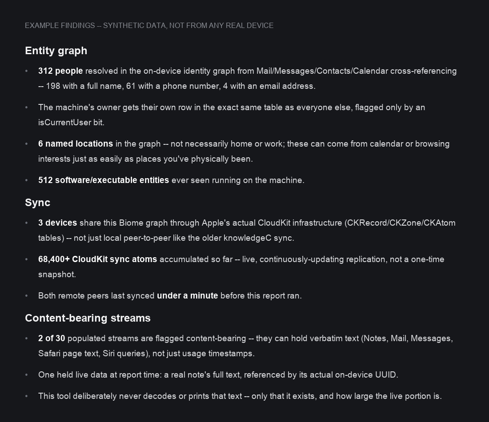

# biome-privacy-audit

**Apple quietly built a knowledge graph of the people you know, and syncs it to your other
devices through the same cloud database it uses for everything else.**

[](LICENSE)
[](#requirements)
[](#requirements)
[](biome_audit.py)

The sibling project [knowledgec-privacy-audit](https://github.com/jsawyerdev/knowledgec-privacy-audit)
looked at macOS's older activity log. Digging into that led to something bigger: **Biome**
(`~/Library/Biome`), Apple's newer and much larger tracking store -- over a hundred data
streams, a real on-device "who do you know" identity graph, and a sync layer built on actual
CloudKit, not just local peer-to-peer. This is a dependency-free Python script that shows you
what's in it, on your own machine, without ever reading or printing the sensitive content some
of those streams can hold.

```bash
git clone https://github.com/jsawyerdev/biome-privacy-audit
cd biome-privacy-audit
python3 biome_audit.py report
```

## What's actually in there

`~/Library/Biome` defines **107 distinct event streams**, of which roughly a quarter are
populated on a typical Mac. It's TCC-gated exactly like the older `knowledgeC.db`, but it goes
well beyond app-usage logging:

- **An on-device identity graph** (`databases/IntelligencePlatform.Entity.sqlite3`) -- a real,
  directly queryable SQLite database with full-text-indexed `Person` and `Location` tables.
  It's built by cross-referencing Mail, Messages, Contacts, and Calendar, and it resolves the
  machine's own owner as just another row, distinguished only by an `isCurrentUser` flag.
- **Content-bearing streams.** A subset of streams -- everything under `ProactiveHarvesting.*`
  and `Siri.Remembers.*`, plus `App.Intents.Transcript` -- store **verbatim text**, not usage
  metadata. `ProactiveHarvesting.Notes`, for example, can hold the actual full text of a real
  Notes.app note, referenced by its real on-device UUID. This is categorically different from
  `knowledgeC.db`, which only ever logged *that* you used an app, never *what you wrote* in it.
- **Cached entity sets** (`sets/Default/*`) -- separate small SQLite stores caching your
  Contacts, Calendar events, HomeKit homes, and installed apps, plus (if your Photos library
  has one) a `Photos.PetRelationship` record from Apple's on-device pet-detection ML.
- **A CloudKit-backed sync layer** (`sync/sync.db`). Unlike `knowledgeC.db`'s local
  Rapport/Continuity sync, this schema is built directly on CloudKit's own primitives --
  tables literally named `CKRecord`, `CKZone`, and `CKAtom`. That's Apple's real per-user cloud
  database service, not just phone-to-phone replication.

## Why this tool draws a hard line at content

This is the most important design decision in the script, so it's worth stating plainly:
**`biome_audit.py` never reads or prints the payload of a content-bearing stream.** It reports
that a stream like `ProactiveHarvesting.Notes` is populated and how many live bytes it holds --
never the text inside. The entity-graph section reports counts and field-population rates
(how many of the people in the graph have a captured email, phone number, etc.) and, for your
own identity row only, your resolved name. It never lists other people's names, emails, phone
numbers, or raw addresses/coordinates.

If you extend this tool, keep that boundary. A report tool that prints someone else's phone
number to prove a point isn't a privacy tool anymore.

## Requirements

- macOS (Biome doesn't exist on other platforms).
- Python 3.10 or newer (`python3 --version`; macOS ships one).
- Full Disk Access granted to whatever will run the script.

## Granting Full Disk Access

Same requirement as the sibling knowledgeC tool, and for the same reason -- this data is
sensitive enough that Apple gates it even from the owning user by default:

1. Open System Settings -> Privacy & Security -> Full Disk Access.
2. Click `+` and add the application you'll run this from (Terminal.app, iTerm, VS Code, etc.).
3. Turn the toggle on.
4. Fully quit (Cmd+Q) and reopen that application. A window restart is not enough -- TCC
   checks at process launch.

## Usage

```bash
python3 biome_audit.py report
python3 biome_audit.py report --top 40
python3 biome_audit.py purge            # asks for confirmation
python3 biome_audit.py purge --yes      # no prompt
python3 biome_audit.py --biome-path /path/to/copy report   # test against a copy
```

`report` never writes anything. `purge` deletes the *current contents of stream ring-buffer
files only* -- it does not touch the SQLite entity-graph, cached-set, or sync databases. Safe
deletion semantics for those (whether the owning daemon rebuilds cleanly, whether it disrupts
CloudKit sync state) aren't established yet; see Limitations.

### Example findings

Every value below is fabricated by [assets/generate_example_report.py](assets/generate_example_report.py)
-- none of it is pulled from a real machine.



## Important limitations

- **Purging only clears stream ring buffers, not the databases.** The entity graph, cached
  Contacts/Calendar/HomeKit sets, and the sync database are all left untouched. Clearing those
  safely -- without corrupting a live CloudKit sync session or breaking a daemon mid-write --
  needs more research; contributions welcome.
- **Purging does not stop future logging or future sync.** Whatever daemon owns these files
  will recreate and repopulate them; nothing here disables Biome collection at the source.
- **The stream binary format (`SEGB`) isn't decoded.** This tool reports file counts, sizes,
  and a live/allocated byte ratio (stream files are pre-allocated fixed-size ring buffers, so
  raw file size wildly overstates what's actually stored) -- it does not parse individual
  records inside them. That's a deliberate scope boundary, not a missing feature: decoding
  those records would mean decoding people's actual harvested content.
- **This does not cover iOS/iPadOS.** Those devices have their own Biome store; this tool only
  reads a local macOS copy.
- **Be careful sharing `report` output anyway.** Even with content and third-party PII
  withheld, the entity-graph counts, sync-peer timing, and stream list say a fair amount about
  how a machine is used. Consider what a screenshot reveals before posting it.

## Contributing

Two things would help most:

1. **Safe purge semantics for the SQLite stores.** If you can establish that clearing
   `IntelligencePlatform.Entity.sqlite3` or `sync/sync.db` doesn't corrupt state or break Siri
   Suggestions, a PR with evidence (not just "it seemed fine") is very welcome.
2. **Coverage for streams not seen yet.** `strings`-level or schema-level notes on any of the
   79 currently-dormant stream names, or metadata columns this tool doesn't summarize, help
   the next person who finds something new.

## License

MIT. See [LICENSE](LICENSE). Maintained by jsdev.
